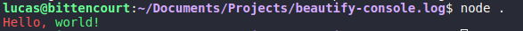

# Beautify log


## Description

A Node.js script to beautify the console.log from JavaScript with colors, making it easy and useful.

## How to use

-   type `yarn add beautify.log` or `npm i beautify.log -s`

## Documentation

All parameters are case-insensitive.

| Parameter    | Result                                   |
| ------------ | ---------------------------------------- |
| {reset}      | Resets to the default color              |
| {bright}     | Shines the text                          |
| {dim}        | Dims the tex                             |
| {underscore} | Puts an underline                        |
| {blink}      | Blinks the text                          |
| {reverse}    | Reverses background and foreground color |
| {hidden}     | Hides the text                           |
| {fgblack}    | Foreground's color                       |
| {fgred}      | Foreground's color                       |
| {fggreen}    | Foreground's color                       |
| {fgyellow}   | Foreground's color                       |
| {fgblue}     | Foreground's color                       |
| {fgmagenta}  | Foreground's color                       |
| {fgcyan}     | Foreground's color                       |
| {fgwhite}    | Foreground's color                       |
| {bgblack}    | Background's color                       |
| {bgred}      | Background's color                       |
| {bggreen}    | Background's color                       |
| {bgyellow}   | Background's color                       |
| {bgblue}     | Background's color                       |
| {bgmagenta}  | Background's color                       |
| {bgcyan}     | Background's color                       |
| {bgwhite}    | Background's color                       |

## Code

```js
const beautify = require('beautify.log');

beautify.log('{fgRed}Hello, {fgGreen}world!'); // Hello, world!
```

## Image



## Author

| [<br><sub>@lucasnaja</sub>](https://github.com/lucasnaja) |
| :------------------------------------------------------------------------------------------------------------------------------: |

